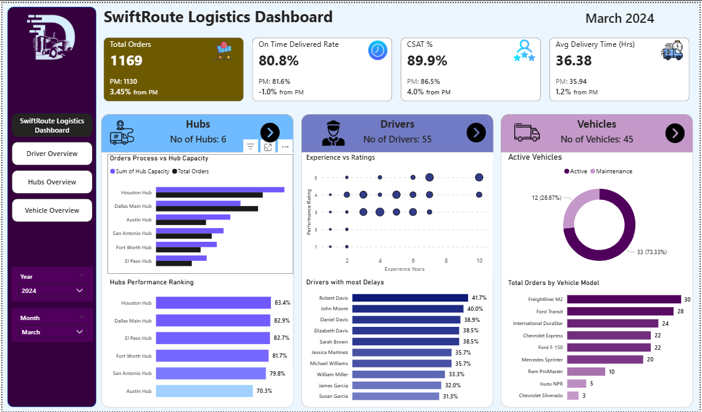

# 🚚 SwiftRoute Logistics Dashboard

## 📊 Overview
This project is a Power BI dashboard analyzing logistics performance including orders, drivers, hubs, and vehicles.

## 📈 Key Metrics
- Total Orders: 1169
- On-Time Delivery: 80.8%
- CSAT: 89.9%
- Avg Delivery Time: 36.38 hrs

## 🛠 Tools
- Power BI
- Excel
- DAX

## 📸 Dashboard Preview

## 💡 Insights
- Some hubs are overloaded
- Experienced drivers perform better
- Delivery delays linked to specific drivers

## 👤 Author
Titani Phopare
